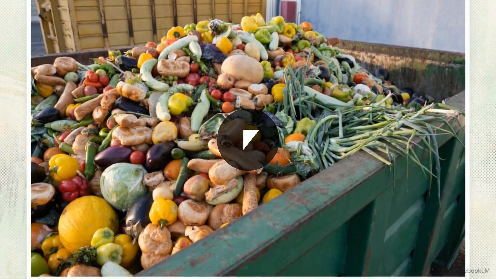

# Project HELIOS: Feed Humanity

**Starvation is a routing problem. This repo is the fix.**

[](LICENSE)
[](https://twitter.com/search?q=%23FeedHumanity)

**Try it now. No setup required:** [feedhumanity2026.com](https://www.feedhumanity2026.com)

Enter your zip code. Get a personalized AI action plan. Feed someone. No accounts, no API keys, no friction.

<p align="center">
  <a href="https://www.jmthomasofficial.com/feedhumanity/feed-humanity-helios.mp4">
    
  </a>
  <br>
  <strong>▶ Watch: The Complete Step-by-Step Guide</strong>
</p>

<p align="center">
  <a href="https://jmthomasofficial.com/helios/helios-full-strategy.m4a">🔊 <strong>Listen to the full blueprint.</strong></a>
  <br>
  10 CEO challenges. The AI dispatch architecture. A 4-week execution timeline.<br>
  And the question no one building AGI wants to answer.
  <br><br>
  <em>Feeding Humanity with Project HELIOS</em><br>
  One builder. One pipeline. One ask that reframes who artificial intelligence actually works for.
</p>

---

Jensen Huang says AGI is here. 318 million people are hungry. This repo contains everything you need to help fix that, whether you're one person with $5, a restaurant with surplus food, or a Fortune 500 company looking for the highest-ROI act of corporate responsibility in history.

---

## How It Works

**For visitors (no setup needed):** Enter your zip code and get a personalized AI action plan. Free. No accounts, no API keys. Powered by server-side AI with 5 free plans per IP per day.

**For power users:** Add your own free Gemini key in ⚙️ Settings for unlimited plans. Your key stays in your browser. It never touches the server.

**For self-hosters:** Fork this repo, add your own API keys to `api-config.php`, and run your own instance for your community.

---

## The Core Mechanic

1. **Buy a meal** for someone who needs one. Fast food, groceries, a hot plate. Anything edible counts.
2. **Give it** to them. You don't have to be on camera. The food is the act.
3. **Share it:** film the handoff (food + handshake, not their face), snap the meal before you give it, or just post a text: *"I just fed someone in [City]. You in?"*
4. **Post** with `#FeedHumanity` + your city.
5. **Challenge three people** by name. That's how it spreads.

---

## For Self-Hosters

Run your own instance for your city or community. You'll need PHP hosting (Namecheap, Bluehost, SiteGround, etc.) and a free Gemini API key.

### Quick Setup (5 minutes)

**Step 1: Download the files**

Clone this repo or download the ZIP and upload all files to your web host's public directory.

**Step 2: Get a free Gemini API key (30 seconds)**

1. Go to [aistudio.google.com/app/apikey](https://aistudio.google.com/app/apikey)
2. Sign in with your Google account
3. Click **"Create API key"** → **"Create API key in new project"**
4. Copy the key. You'll need it in Step 3.

**Step 3: Configure your server**

Copy `api-config.example.php` to `api-config.php`:
```
cp api-config.example.php api-config.php
```
Open `api-config.php` and paste your Gemini key:
```php
define('GEMINI_API_KEY', 'paste-your-key-here');
```

**Step 4: Optional: Google Maps API for better food bank results**

Without a Maps key, the app uses free OpenStreetMap/Overpass data. Works well in most cities. For better results in rural areas, add a Google Maps key.

#### Enabling the Google Cloud APIs

You need to enable 3 APIs in Google Cloud Console:


1. Go to [console.cloud.google.com](https://console.cloud.google.com) and create a project
2. Navigate to **APIs & Services → Library** and enable these three:
   - **Geocoding API**: converts zip codes to coordinates
   - **Places API** (Legacy): finds food banks and grocery stores nearby
   - **Maps JavaScript API**: powers the map display on your site
3. Go to **APIs & Services → Credentials** → **Create Credentials** → **API Key**
4. Copy the key and add it to `api-config.php`:
```php
define('MAPS_API_KEY', 'paste-your-maps-key-here');
```

> Google gives $200/month in free API credits, more than enough for a community deployment.

**Step 5: Upload and test**

Upload all files to your web host. Visit your domain. Enter a zip code. Your instance is live.

> **Note:** `rate-limit.json` and `impact-data.json` need write access. Set `chmod 666` on them, or let PHP create them automatically on first use.

### How the server-side proxy works

| File | Purpose |
|------|---------|
| `gemini-proxy.php` | Relays AI requests to Gemini with the site owner's key. Enforces 5 free plans/IP/day. |
| `foodbank-search.php` | Server-side food bank + grocery store search using your Maps key (no CORS issues). |
| `api-config.php` | Your private keys. Gitignored, never committed. |
| `api-config.example.php` | Template to copy and fill in. |
| `rate-limit.json` | Auto-created on first use. Tracks daily usage per IP (hashed for privacy). |

When a visitor generates a plan with no personal key, the request goes through `gemini-proxy.php` using the site owner's Gemini key. After 5 plans, they see a friendly message offering to add their own key for unlimited access. This keeps the Gemini free tier sustainable across hundreds of unique visitors daily.

---

## Project Structure

| Path | What It Does |
|------|-------------|
| `index.html` | Complete frontend: AI playbook generator, impact tracker, viral challenge system |
| `gemini-proxy.php` | Server-side Gemini relay with rate limiting (5 free plans/IP/day) |
| `foodbank-search.php` | Server-side food bank + grocery store search (Google Maps or Overpass fallback) |
| `api-config.example.php` | Configuration template. Copy to `api-config.php` and fill in your keys. |
| `api-config.php` | Your private keys (gitignored; create this manually, never commit it) |
| `nim-proxy.php` | CORS relay for NVIDIA NIM (optional alternative LLM provider) |
| `impact-api.php` | Flat-file impact tracking API |
| `ai-dispatch/` | Surplus-to-deficit matching engine (Python) |
| `ai-playbook/` | Playbook generation backend (legacy Python, superseded by server-side proxy) |
| `playbooks/` | All six participation tiers as standalone markdown guides |
| `event-kit/` | Organizer resources: logistics checklists, social templates |

---

## Participation Tiers

| Tier | Who | Budget | Time |
|------|-----|--------|------|
| Individual | One person | $5–$50 | 30 min |
| Crew | 2–10 friends | $50–$200 | 2 hrs |
| Organizer | Community leader | $200–$1,000 | 1 week |
| Small Business | Local business | $500–$5,000 | Ongoing |
| Corporation | Mid-size company | $5K–$50K | Quarter |
| Tech Giant | Major tech company | $1M+ | Permanent |

---

## Hashtags

**Primary:** `#FeedHumanity`. Every post is counted.

**City tag:** Add your city. `#FeedHumanityNashville`, `#FeedHumanityLondon`, `#FeedHumanityTokyo`. This feeds the city leaderboard and helps locals find each other.

**Supporting:**
- `#OneMealChallenge`: the atomic unit
- `#AGIForGood`: ties to the tech narrative
- `#FeedForward`: the chain reaction mechanic

---

## The AI Layer

The app runs entirely server-side for visitors. No API key required to get started.

AI is not decorating this campaign. It is doing real logistics work:

**AI Playbook Generator.** Enter your zip code, budget, and available time. Get a personalized action plan using real food banks near you, actual stores with honest price estimates, and a viral challenge tailored to your city. No generic advice.

**AI Dispatch** (`ai-dispatch/`): A real-time surplus-to-deficit matching engine. Restaurants and grocery stores register surplus food. Food banks and shelters register what they need. The system matches supply to demand, optimizing for distance, perishability, and transport windows. 80 billion pounds of food are wasted annually in the US. This routes it to people who need it.

**AI Impact Tracker.** Every `#FeedHumanity` post is counted and mapped. Real-time stats. Real meals. Real proof.

---

## How the Routing Actually Works (End to End)

The AI dispatch engine is not a concept. Here is the full operational loop, from a restaurant with leftover food to a family eating dinner.

### Step 1: A business reports surplus

A restaurant owner has 40 plates of food at closing time. They text a local HELIOS number: "40 plates ready." That is it. No app to download. No account to create. No form to fill out. One text message, under 10 seconds.

After a few times, it gets even easier. HELIOS texts them at their usual closing time: "Surplus tonight? Reply Y or a number." One character. Done. A tax receipt arrives in their email after pickup. They never coordinate logistics, track anything, or wait around.

### Step 2: The routing engine matches supply to need

The AI scores every possible match across four signals: distance (how far is the nearest food bank?), perishability (how many hours until this food is no good?), volume fit (does the quantity match what the recipient actually needs?), and dietary alignment (a halal shelter needs halal food). The match with the highest composite score wins.

This scoring engine improves itself automatically through the [HELIOS AutoResearch loop](https://github.com/jmthomasofficial/helios-autoresearch). An AI agent rewrites the scoring logic, tests it against real city data, keeps what works, throws away what doesn't, and repeats. The routing gets better at feeding people without anyone touching the code.

### Step 3: A volunteer picks it up

A volunteer running the HELIOS app (a Progressive Web App that works on any phone, no app store needed) gets a notification: "Pick up 40 plates at Broadway BBQ. Deliver to Second Harvest Nashville. 3.2 km. Accept?"

They accept. They navigate to the business. At pickup, they take a photo and count the actual food. Listed: 40 plates. Actual: 36 (4 were already claimed by staff). That discrepancy becomes data that makes future predictions more accurate.

### Step 4: Delivery and confirmation

The volunteer delivers to the recipient org, takes a delivery photo, and confirms the handoff. The recipient rates the delivery. The business gets an auto-generated tax receipt. The volunteer sees their running impact total: "You've delivered 340 meals this month."

### Step 5: The data feeds back into everything

Every completed mission generates approximately 30 data points: timestamps, GPS coordinates, actual versus listed quantities, food condition, photos, recipient satisfaction, waste amounts. This data flows back into the autoresearch engine, which uses it to improve routing accuracy.

The system tracks a prediction for every match (how good did the AI think this match would be?) against the actual outcome (how good was it really?). The gap between those two numbers is the error signal. Over hundreds of missions, the routing engine learns patterns about specific businesses, neighborhoods, food types, and time windows that no human would think to program.

### What stays human

Volunteers pick up and deliver the food. Humans build relationships with local businesses. Community organizers recruit volunteers and expand to new neighborhoods. The AI handles the math. Humans handle the trust. That division is permanent.

### Decentralized by design

There is no central server. Each city runs its own HELIOS node: a Docker container with a SQLite database, a FastAPI backend, and the volunteer PWA. Costs about $5/month on a basic VPS. Data stays local. The city owns its own data.

Nodes can optionally share anonymized routing improvements with each other. If Nashville discovers that adjusting the distance decay curve feeds 15% more people, every other city benefits. But no personal data, no business data, and no mission details ever leave the local node.

Anyone can spin up a node for their city. Clone the repo, set up a Twilio number for SMS intake, and start recruiting businesses and volunteers.

---

## The Moment

We're in the AGI moment. Jensen Huang said it. The models confirm it. 318 million people are still hungry. 80 billion pounds of food are wasted in the US alone every year. Not because there isn't enough food. Because there's no routing layer connecting surplus to need.

We built that routing layer. The AI surplus-to-deficit matching engine is functional. The server-side playbook generator works for anyone with a zip code. The viral challenge mechanic is already spreading. The code is open. The mechanism is real.

**What's missing is the infrastructure, data, and logistics that only you can provide.**

---

### If you run a tech company

Buying someone lunch is the floor, not the ceiling. Here's what would actually move the needle:

**Compute & infrastructure.** The AI Dispatch engine matches surplus food to food banks using weighted scoring across distance, perishability, volume, and dietary needs. Right now it runs on a local machine. It needs cloud compute at scale. Google, Microsoft, NVIDIA: donate cloud credits or GPU access. It also needs edge deployment when this goes viral. Right now it lives on shared PHP hosting. Cloudflare, AWS, Google Cloud: one deployment decision serves the world.

**Data.** The food bank search uses Google Places and OpenStreetMap. 211.org and FindHelp.org maintain verified databases of every food resource in America and have developer APIs. A data partnership with either organization doubles search accuracy overnight, especially in rural areas where Google Places data is thin.

**Logistics.** Amazon has last-mile delivery infrastructure and is already a Feeding America Visionary Partner. Uber Eats and DoorDash have the drivers and routing algorithms. Whole Foods, Walmart, and Target know which items expire today. The AI Dispatch engine is ready to route surplus food. It needs live inventory feeds and a truck.

**Platform reach.** #FeedHumanity is a viral mechanic waiting for fuel. Meta, TikTok, Twitter/X: your algorithm decides whether this reaches 1 million people or 1 billion. One internal campaign decision is worth more than any ad budget.

**Financial rails.** Corporate pledges need to move instantly from decision to food. Stripe, PayPal, Square: a payment integration routing dollars directly to registered food partners makes every corporate commitment verifiable, trackable, and real.

---

The companies that fed humanity during this moment will be remembered. Not because someone issued a press release. Because the code is open-source, the impact data is public, and every meal matched is a number that doesn't lie.

The playbook for your tier is in `playbooks/tech-giant.md`.

---

## License

[MIT](LICENSE). Fork it, clone it, deploy it in your city. The goal is maximum impact, not IP protection.
