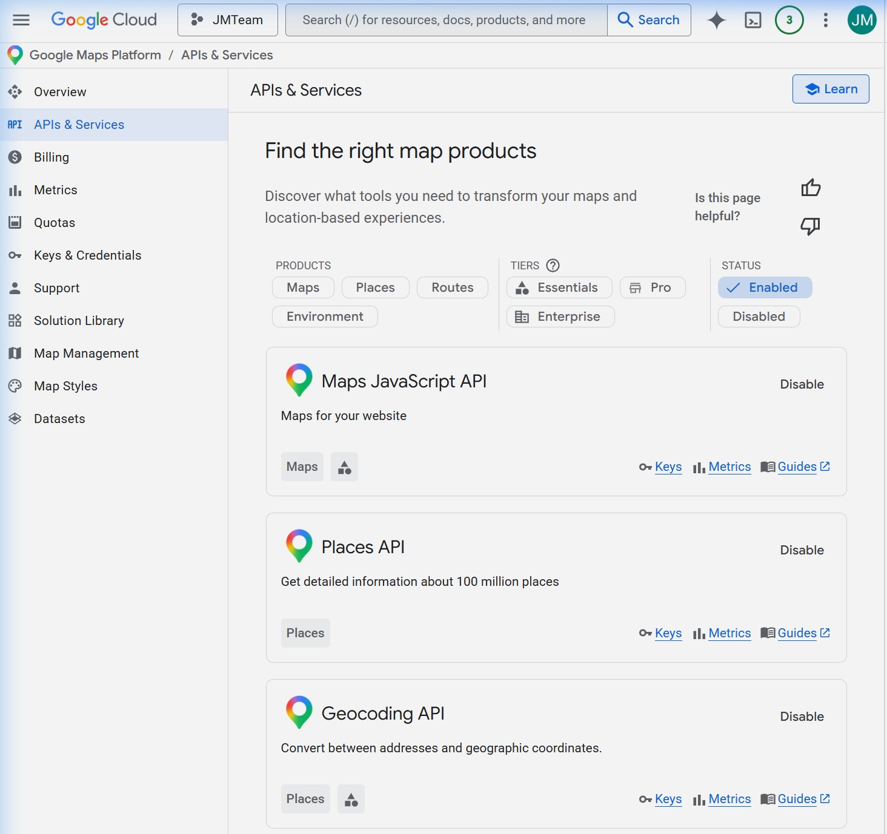

# Feed Humanity

[](LICENSE)
[](https://twitter.com/search?q=%23FeedHumanity)

**Try it now — no setup required:** [feedhumanity2026.com](https://www.feedhumanity2026.com)

Enter your zip code. Get a personalized AI action plan. Feed someone. No accounts, no API keys, no friction.

---

Jensen Huang says AGI is here. 318 million people are hungry. This repo contains everything you need to help fix that — whether you're one person with $5, a restaurant with surplus food, or a Fortune 500 company looking for the highest-ROI act of corporate responsibility in history.

---

## How It Works

**For visitors (no setup needed):** Enter your zip code → get a personalized AI action plan. Free. No accounts, no API keys. Powered by server-side AI with 5 free plans per IP per day.

**For power users:** Add your own free Gemini key in ⚙️ Settings for unlimited plans. Your key stays in your browser — it never touches the server.

**For self-hosters:** Fork this repo, add your own API keys to `api-config.php`, and run your own instance for your community.

---

## The Core Mechanic

1. **Buy a meal** for someone who needs one. Fast food, groceries, a hot plate — anything edible counts.
2. **Give it** to them. You don't have to be on camera. The food is the act.
3. **Share it** — film the handoff (food + handshake, not their face), snap the meal before you give it, or just post a text: *"I just fed someone in [City]. You in?"*
4. **Post** with `#FeedHumanity` + your city.
5. **Challenge three people** by name. That's how it spreads.

---

## For Self-Hosters

Run your own instance for your city or community. You'll need PHP hosting (Namecheap, Bluehost, SiteGround, etc.) and a free Gemini API key.

### Quick Setup (5 minutes)

**Step 1 — Download the files**

Clone this repo or download the ZIP and upload all files to your web host's public directory.

**Step 2 — Get a free Gemini API key (30 seconds)**

1. Go to [aistudio.google.com/app/apikey](https://aistudio.google.com/app/apikey)
2. Sign in with your Google account
3. Click **"Create API key"** → **"Create API key in new project"**
4. Copy the key — you'll need it in Step 3

**Step 3 — Configure your server**

Copy `api-config.example.php` to `api-config.php`:
```
cp api-config.example.php api-config.php
```
Open `api-config.php` and paste your Gemini key:
```php
define('GEMINI_API_KEY', 'paste-your-key-here');
```

**Step 4 — Optional: Google Maps API for better food bank results**

Without a Maps key, the app uses free OpenStreetMap/Overpass data — works well in most cities. For better results (especially rural areas), add a Google Maps key.

#### Enabling the Google Cloud APIs

You need to enable 3 APIs in Google Cloud Console:



1. Go to [console.cloud.google.com](https://console.cloud.google.com) and create a project
2. Navigate to **APIs & Services → Library** and enable these three:
   - **Geocoding API** — converts zip codes to coordinates
   - **Places API** (Legacy) — finds food banks and grocery stores nearby
   - **Maps JavaScript API** — powers the map display on your site
3. Go to **APIs & Services → Credentials** → **Create Credentials** → **API Key**
4. Copy the key and add it to `api-config.php`:
```php
define('MAPS_API_KEY', 'paste-your-maps-key-here');
```

> Google gives $200/month in free API credits — more than enough for a community deployment.

**Step 5 — Upload and test**

Upload all files to your web host. Visit your domain. Enter a zip code. Your instance is live.

> **Note:** `rate-limit.json` and `impact-data.json` need write access. Set `chmod 666` on them, or let PHP create them automatically on first use.

### How the server-side proxy works

| File | Purpose |
|------|---------|
| `gemini-proxy.php` | Relays AI requests to Gemini with your server key. Enforces 5 free plans/IP/day. |
| `foodbank-search.php` | Server-side food bank + grocery store search using your Maps key (no CORS issues). |
| `api-config.php` | Your private keys — gitignored, never committed. |
| `api-config.example.php` | Template to copy and fill in. |
| `rate-limit.json` | Auto-created on first use. Tracks daily usage per IP (hashed for privacy). |

When a visitor generates a plan with no personal key, the request goes through `gemini-proxy.php` using the site owner's Gemini key. After 5 plans, they see a friendly message offering to add their own key for unlimited access. This keeps the Gemini free tier (1,500 requests/day) sustainable across ~300 unique visitors daily.

---

## Project Structure

| Path | What It Does |
|------|-------------|
| `index.html` | Complete frontend — AI playbook generator, impact tracker, viral challenge system |
| `gemini-proxy.php` | Server-side Gemini relay with rate limiting (5 free plans/IP/day) |
| `foodbank-search.php` | Server-side food bank + grocery store search (Google Maps or Overpass fallback) |
| `api-config.example.php` | Configuration template — copy to `api-config.php` and fill in your keys |
| `api-config.php` | Your private keys (gitignored — create this manually, never commit it) |
| `nim-proxy.php` | CORS relay for NVIDIA NIM (optional alternative LLM provider) |
| `impact-api.php` | Flat-file impact tracking API |
| `ai-dispatch/` | Surplus-to-deficit matching engine (Python) |
| `ai-playbook/` | Playbook generation backend (legacy Python — superseded by server-side proxy) |
| `playbooks/` | All six participation tiers as standalone markdown guides |
| `event-kit/` | Organizer resources: logistics checklists, social templates |

---

## Participation Tiers

| Tier | Who | Budget | Time |
|------|-----|--------|------|
| Individual | One person | $5–$50 | 30 min |
| Crew | 2–10 friends | $50–$200 | 2 hrs |
| Organizer | Community leader | $200–$1,000 | 1 week |
| Small Business | Local business | $500–$5,000 | Ongoing |
| Corporation | Mid-size company | $5K–$50K | Quarter |
| Tech Giant | Major tech company | $1M+ | Permanent |

---

## Hashtags

**Primary:** `#FeedHumanity` — every post is counted.

**City tag:** Add your city. `#FeedHumanityNashville`, `#FeedHumanityLondon`, `#FeedHumanityTokyo`. This feeds the city leaderboard and helps locals find each other.

**Supporting:**
- `#OneMealChallenge` — the atomic unit
- `#AGIForGood` — ties to the tech narrative
- `#FeedForward` — the chain reaction mechanic

---

## The AI Layer

The app runs entirely server-side for visitors — no API key required to get started.

AI is not decorating this campaign. It is doing real logistics work:

**AI Playbook Generator** — Enter your zip code, budget, and available time. Get a personalized action plan using real food banks near you, actual stores with honest price estimates, and a viral challenge tailored to your city. No generic advice.

**AI Dispatch** (`ai-dispatch/`) — A real-time surplus-to-deficit matching engine. Restaurants and grocery stores register surplus food. Food banks and shelters register what they need. The system matches supply to demand, optimizing for distance, perishability, and transport windows. 80 billion pounds of food are wasted annually in the US. This routes it to people who need it.

**AI Impact Tracker** — Every `#FeedHumanity` post is counted and mapped. Real-time stats. Real meals. Real proof.

---

## The Moment

The companies that fed humanity during the AGI moment will be remembered forever. The ones that did not will be asked why.

If you run a tech company: the CEO challenge is in `playbooks/tech-giant.md`. Buy someone lunch. Film it. The headline writes itself.

---

## License

[MIT](LICENSE) — fork it, clone it, deploy it in your city. The goal is maximum impact, not IP protection.
